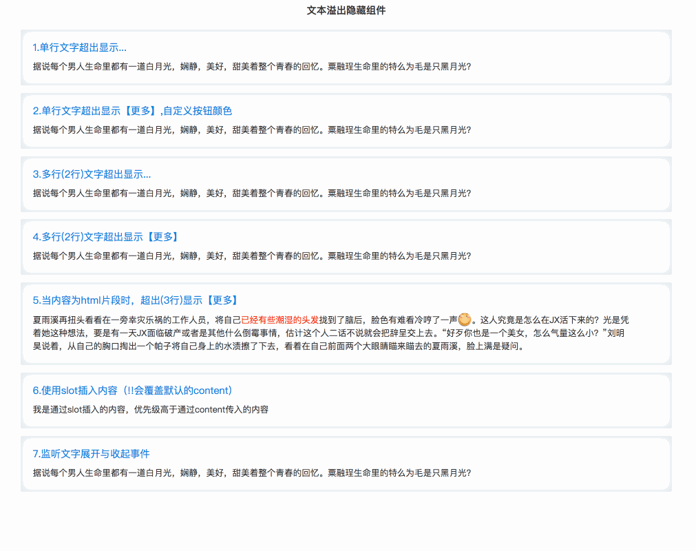
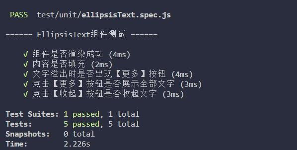

<p>
  
  
</p>

> _A vue component for web developers._<br>
> 文字溢出隐藏组件，基于 vue 编写，用于 web 表单页面，支持移动端。

---

<br>

### 一、组件功能

- 支持单行、多行文字溢出显示点点点 or【更多】按钮，如下图所示（对应 App.vue 中的示例）

  

- 点击【更多】按钮可展开显示所有文字，点击【收起】按钮可收起文字（视具体情况）。

<br>

### 二、使用演示


<br>

### 三、组件参数及事件

**参数**

| 参数            | 说明                                                     | 类型    | 默认值   |
| --------------- | :------------------------------------------------------- | ------- | -------- |
| content         | 内容                                                     | String  | ""       |
| triggerMore     | 点击更多时候是否触发展开操作                             | Boolean | true     |
| line            | 展示几行文字                                             | Number  | 1        |
| hasMore         | 是否显示更多按钮                                         | Boolean | false    |
| isHtml          | 是否是 html 内容                                         | Boolean | false    |
| revealWidth     | 更多按钮宽度（若文字被"更多"按钮覆盖，可自行调整此参数） | Number  | 70       |
| revealText      | 更多按钮文案                                             | String  | 【全部】 |
| foldText        | 收起按钮文案                                             | String  | 收起     |
| revealTextColor | 更多按钮文案颜色                                         | String  | ''       |
| foldTextColor   | 收起按钮文案颜色                                         | String  | ''       |

**slot**

支持通过 slot 的传入内容，优先级高于通过 content 传入的内容，同时使用只会展示 slot 传入的内容

```
<ellipsis-text :hasMore="true">
  <div>我是通过slot插入的内容，优先级高于通过content传入的内容</div>
</ellipsis-text>
```

**事件**

| 事件名 | 说明           |
| ------ | :------------- |
| reveal | 展开文字时触发 |
| fold   | 收起文字时触发 |

<br>

### 四、使用方法

1、使用 npm 下载组件到项目中，引入即可使用

> npm install -s vue-ellipsis-text

```javascript
import EllipsisText from "vue-ellipsis-text";

export default {
  name: "app",
  components: { EllipsisText },
  data() {
    return {
      content: "这是一段很长的测试文字，是哦，好长啊，才不到30字。", // 内容
    };
  },
};
```

```javascript
<ellipsis-text :content="content"></ellipsis-text>
```

2、普通 html 中直接引入使用 [注意：普通 html 中，如果 prop 属性为驼峰式，需要修改为连字符形式，方可识别。如：hasMore 修改为 has-more]

```html
<!DOCTYPE html>
<html lang="en">
  <head>
    <meta charset="utf-8" />
    <title>ellipsis-text</title>
    <script src="https://cdn.staticfile.org/vue/2.5.2/vue.min.js"></script>
    <script src="../dist/ellipsisText.umd.js"></script>
  </head>
  <body>
    <div id="app">
      <ellipsis-text
        content="这是一段很长的测试文字，是哦，好长啊，才不到30字。"
      ></ellipsis-text>
    </div>
    <script>
      new Vue({
        el: "#app",
      });
    </script>
  </body>
</html>
```

### 五、项目相关操作

- 安装依赖： `npm install`
- 运行组件 demo（serve with hot reload at localhost:3000）：`npm start`
- 单元测试（基于 Jest + vue-test-utils ）：`npm test`
- 组件打包，输出用于生产环境的文件（包含 esm，amd，cmd，umd 规范）：`npm run build`

### 单元测试结果（PASSED）



### 感激

感谢以下的项目，排名不分先后

- [vue](https://cn.vuejs.org/)
- [vue-test-utils](https://vue-test-utils.vuejs.org/)

### 版权

— MIT License —
